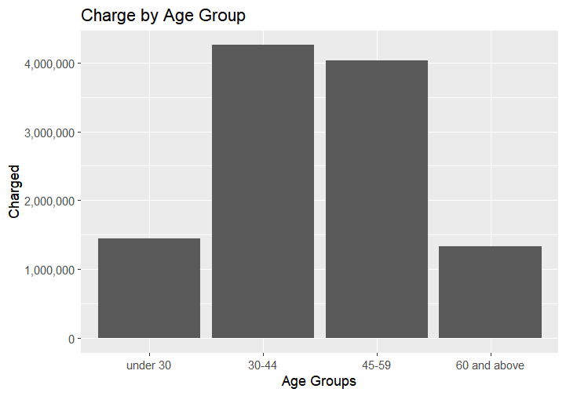
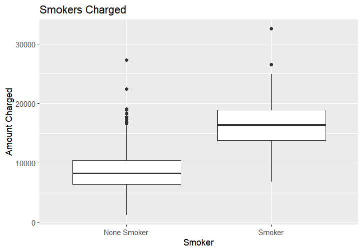

# 1) Dataförståelse
source("../scripts/")
```{r}

source("../scripts/load_data.R")
source("../scripts/utility.R")

df_raw <- load_data("../data/insurance_costs.csv")
look_at_data(df_raw,skip_col = "customer_id")

```

The Dataset consists of 1100 rows and 14 columns.

There are only char and dbl data types and  customer_id has data type char thanks to "C100000" having
a C in front.

Missing Values:

- bmi: 28 missing values.
- exercise_level: 22 missing values.
- annual_checkups: 20 missing values.

Inconsistencies in the date:

inconsistent capitalization:

- region: "north" and "North", "south" and "Shouth"
- smoker: "yes" and "Yes"
- plan_type: "standard" and "Standard", "premium" and "Premium"

# 2) Datastädning och förberedelse

```{r}
source("../scripts/clean_data.R")
df_clean <- clean_data(df_raw)
look_at_data(df_clean)
```
## 2.1) Datastädning och förberedelse Clean up
Removed the C from customer_id.

Made new Column:

- age_group age < 30 =  "under 30", age < 45 = "30-44", age < 60 = "45-59", the rest = "60 and above"

Filled missing inside Columns:

- exercise_level by taking the median as something like exercise can easily be screwed both high and low.
- annual_checkups by taking the median for the same reason as exercise_level.
- bmi by grouping the bmi by sex, age_group,exercise_level and taking the median value.

Change datatypes:

From char to factor:

- sex
- region
- exercise_level
- plan_type

From dbl to int:

- age
- children
- prior_accidents      
- prior_claims   
- annual_checkups           

From char to logic:

- smoker
- chronic_condition    


```{r}
source("../scripts/add_column.R")
df_add_column <- bmi_category(df_clean)
df_add_column <- health_risk_level(df_add_column)
look_at_data(df_add_column)
```
## 2.2) Datastädning och förberedelse Add columns

Added columns:

- bmi_category: 
bmi < 18.5 = "under weight",  bmi < 25 = "normal weight", bmi < 30 = "over weight", bmi < 35 = "obese", the rest = "severely obese". 

- health_risk_level:
added 3 level´s "high risk" "medium risk" "low risk".

-high risk:

for smokers and people with chronic_condition, people under the under weight and severely obese as well as people who are obese and only have exercise_level on low. 

People who smoke and have chronic_condition tend to have more health problem and need more medical care.

people who are severely obese have a hard time taking care of themselves and often dont exercise which both lead to health problem and the need for medical assistance ( someone to help take care of them).

people who are under weight have a higher risk of injuries and harder time with sickness as their bodies are often under nourished or fragile. 

- medium risk:

people who are obese and who are over weight and low exercise_level are less healthy and more prone to sickness or injuries from life habits and the inability to fight of injuries well or sickness. 

people who are older and dont exercise tend to also have poorer health and harder time fighting off sickness and overcome injuries.

- low risk:

Everyone not in high or medium risk are added here.

# 3) Beskrivande analys


## 3.1  Charge by age group
```{r}

```

The Figure shows 4 age groups:

- under 30
- 30-40
- 45-59
- 60 and above

under 30 and 60 and above are around the same are of roughly 1 400 000 
while 30-40 are roughly at 4 500 000 and 45-59 are around 4 000 000.

this shows that majority of the income comes from people around the age of 30-59. 


## 3.2 Health Risk Level summarize charges
```{r}
source("../scripts/tables.R")
health_risk_level_charges_summarize(df_add_column)
```
There´s a clear trend where low risk pay less while medium risk pay more and high risk pays the highest.

Charged Average:
- low risk average charges:  around 7050
- medium risk average charges:  around 8150
- high risk average charges:  around 12930

High risk group has a high range from min charges (1767) and max charges (32559), both the mean (average) and median charges of the high risk groups are the highest. This indicate that the health_risk_level variable successfully captures important cost differences on average. however the low minimum value of high risk group suggest that some costumers may be classified wrong or should be charged more.

## 3.3 Smoker Charged
```{r}

```
This figure shows that on average smokers are charged more then none smokers but there are several cases of none smokers paying as high as smokers. Meaning that smoker pays more but there are other factors that makes people who dont smoke still get charged a high amount.


## 3.4 charges prior
```{r}

charged_prior_checkup_table(df_add_column)

```
This table shows the average(mean) charges, prior_claims, prior_accident, annual_checkups for each plan_type.

plan Types:
- Basic
- Standard
- Premiums

Charged:
The average charge of each plan type is no all that large, while the min charge and max charge per plan type varied widely. an outlier is that the highest charge is an standard plan type and not premium.

Prior:
On average around 0.27 of costumers have prior claims and 0.24 have prior accidents, that means for every 4 costumer 1 will have made a claim. 

Annual Check up:
Every plan type has slightly above 2 in their average annual check up. meaning on average everyone get at least one probably two checkups per year.


# 4) Regressionsanalys

## 4.1 Regression variable analysis

```{r}
source("../scripts/regression.R")
regression_tibble <- r2_adjr2_per_variable(df_add_column)

```
This function performs a univariate regression analysis (one predictor at a time) to examine the individual linear relationship between each variable and the target variable charges.

Top 5:
- smoker             : R2 = 0.4568    Adj.R2 = 0.4563
- chronic_condition  : R2 = 0.1901    Adj.R2 = 0.1894
- age                : R2 = 0.0667    Adj.R2 = 0.0658
- prior_accidents    : R2 = 0.0596    Adj.R2 = 0.0587
- exercise_level     : R2 = 0.0512    Adj.R2 = 0.0494

Bottom 5:
- bmi                : R2 = 0.0225    Adj.R2 = 0.0217
- annual_checkups    : R2 = 0.0037    Adj.R2 = 0.0028
- region             : R2 = 0.0020    Adj.R2 = -0.0007
- children           : R2 = 0.0010    Adj.R2 = 0.0001
- sex                : R2 = 0.0001    Adj.R2 = -0.0008

Important:
This Analysis only shows individual relationship between each variable and charges and not how they would perform together in a multiple regression model.Some variables may appear weak individually but can still contribute when combined with others.
This Analysis can only be used as a first step for a variable selection.


## 4.2 Regression model.


### 4.2.1 Top 5:

```{r}
model_and_summary(df_add_column, choice = c("smoker", "exercise_level", "chronic_condition", "prior_accidents", "age"))

```
Taking the resulst from the Regression analysis (r2_adjr2_per_variable, funktion) i took the top 5 and did a model to see the results.

Variables:

Dependent variable:
- charges

Independent variables:
- smoker
- exercise_level
- chornic_condition
- prior_accidents
- age

Summery:
- R-Squared = 0.7007
- Adjusted R-Squared = 0.6991


### 4.2.2 Swap exercise_level for bmi
```{r}
model_and_summary(df_add_column, choice = c("smoker", "bmi", "chronic_condition", "prior_accidents", "age" ))
```
swapped out the variable exercise_level with bmi to see if bmi is a better variable and got a better R-squared then the top 5 model.

Variables:

Dependent variable:
- charges

Independent variables:
- smoker
- bmi
- chornic_condition
- prior_accidents
- age

Summery:
- R-Squared = 0.7093
- Adjusted R-Squared = 0.708


### 4.2.3 Add bmi
```{r}
final_model <- model_and_summary(df_add_column, choice = c("smoker", "exercise_level", "chronic_condition", "prior_accidents", "age", "bmi" ))
final_model
```
for the final model as bmi increased the R-squared i added it and kept exercise_level and got the highest R-Squared result

Variables:

Dependent variable:
- charges

Independent variables:
- smoker
- exercise_level
- chornic_condition
- prior_accidents_
- bmi
- age


Summery:
- R-Squared = 0.7232
- Adjusted R-Squared = 0.7215

Result:

This shows that the top 5 were a acceptable starting point but an variable like bmi that was at the bottom of the list where each variable were tested against charges is more useful then one in the top 5 when it´s in a multiple regression model.

#### 4.2.3.1 interpretation of regression model.

interpretation:

Final model explains 72.15% of the variation in insurance charges (Adjusted R-Squared = 0.7215). This indicates the model has reasonably good explanatory power.

The coefficients:

- smoker: being a smoker increases the charges by 7382 on average with an std error of 190 which is barely 2% of the Estimated meaning it´s very precise. 

- chronic_condition: having a chronic condition on average will cost a customer 4105 more and as an std error of 170 which like with smoker is low compared to the estimated making it precise. 

- age: Each additional year of age is associated with an increase of 68 in charges.

- bmi: each unit in bmi adds on average 153 in charges.

- prior_accidents: each accident add on average 1255 in charges.

- exercise_level: compared to high exercise level, a low exercise level is associated with 1 575 higher in charge while medium is associated with 667 in charges.

all of the above variables has high t value and low p value expect for exercise_level medium. which means they got a statistically significant impact.and even exercise_leve lmedium  has an usable level of t and p value.


which variables seem to be of most importance:

smoker and chronic_condition has the highest impact on the model. 

whether the results seem reasonable:

smoker and chronic_condition are both something that is logical and easy for an insurance company to look at and use for a reason to charge more. bmi and age can also be used and indicate health problems which require them to charge more. prior_accidents means there can be an assumption that they will have more and need to use the insurance. that exercise_level has an impact make sense but is harder as a company to motivate and use as a reason to charge more.

what limitations exist in the model:

it got a total of 0.72 meaning it can explain mathematically explain 72% of the variance in charges, meaning a whole 28% is not explained by the model. there are other factors that is not part of the data that can explain more or less charges and.
There can be factors such as genetics or an area prone to disastrous that could change the charges. 
The model assumes linear relationships between the predictors and charges. 


# 5) Tolkning och slutsatser

## 5.1 which factors seem to have the clearest connection with costs
Most Impactful Variables:
- Smoker: Most impactful alone it explain roughly 45% of the charges. 
- Chronic_condition also very impactful alone it explains roughly 19% of the charges
- Age impactful, alone it explain roughly 6% of the charges
- Bmi alone bmi only stood for roughly 2% but when used with other variables it help explain more then the 2% it does alone.

the 4 of them combined with the regression model explain roughly 69% of the charges and a model that includes every variable explains roughly 75% meaning that smoker and Chronic_condition together explain the majority of what the model can explain and adding age and bmi put´s it at roughly 69% which is only 6% less then they all combined explain.


The model even with all the variable only get roughly 75% meaning a whole 25% cannot be explained by the data when looking at the charges.


## 5.2 what the analysis shows

The analysis shows that smoker is the major factor impacting charges with Chronic condition being second place. the other factors have a minor to no individual impact indicating the company view smoking and chronic condition as risk factors and the other´s as less retentive factors. 

## 5.3 what the model does not capture

The model with all variables only account for 75% so 25% cannot be explained by the model using the existing variables.   
This is a regression model meaning it seeks linear correlations making it unable to capture none linear correlations for example if low bmi and high bmi has a high impact or old age does. 
There can also be many other factors that is not within this data set that affect the price such as known genetic problems that is not included in chronic_condition  as some people might or might not consider genetics defects a chronic_condition. 
When they started the plan and if they paid for a 5 year plan with a price and the plan got more expansive later making newer customers pay more. 
Some empty variables were either filled with a assumed value or discarded which affects the result.

## 5.4 what improvements could have been made

I used a Linear model which cannot capture none linear correlations meaning that factors like Bmi or Age which can easily have a none linear correlation with charges by having a much higher charge rate for old age or high bmi. so excluding them fully and even dropping them could have been an ide. 
to not drop or add values for variables with no values but ignoring them not allowing any phantom data to enter. 
Get a more detailed or more relevant data set, to ignore data that should not affect the outcome such as sex, children, region, annual checkups and focus on the logical and variables that a linear model can explain such as smoker, chronic_condition, prior_claims and plan_type. 


#6) Självreflektion

## 6.1 What do you think you did well in the task?

I like my structure of using scripts and keeping the Rapport.qmd with as little code as possible.


## 6.2 What was the most difficult?

Reading the regression model and describing the summery. choosing the right visuals and tables.
being worried i write to short summery then worried it´s too long and unsure if what i write make sense and has any value and if i´m writing the same thing several times. 
Deciding what should be in which script and giving it a good name and keeping a theme inside the script so they had a pattern.
Making a variable that is useful and has any value even though i did not use them in the regression model as adding something like age_group and keeping age just add´s noise and a combined variable like risk_level has several variables and it felt better to keep the raw data then the summery of the data. 

## 6.3 & 6.4 Which grade do you think your submission corresponds to, G or VG? Briefly justify your reasons by referring to which requirements of the assignment you think you have met.

Grade = G

I´ve managed to take the data set given and clean it up as required and managed to get a model that makes sense and seem to do it´s job. added comment´s where it makes sense and explained what the result showed. Did relevant figures and tables that helped me get an ide and understand the data which i could use to make the regression model.
Shown i can take what i´ve learnt before and translate it into R and use this new language and system to achieved similar results as in Python. 

--------------------------------------------------------------------------------------------------------

# Written report

----------------------

## Purpose

The purpose of this report is to do an analysis of which factors has a strong impact on the charges and if an regression model can be used as support for future pricing for client´s with similar situations.


----------------------

## Method

Used the given data and looked at it and cleaned it up to make it useful and impactful.
Looked at the data and made a few figures and a table to easier visualize and understand the data  so to help with making the regression model.
done a Regression Linear Model using the variables from the cleaned data with charges as the target data and then seen which other variables affected charges.

----------------------

## Results

```{r}

```

This figure shows that smokers pay more then none smokers on average from the data set but also shows that none smoker as more outliers then smokers meaning that there are some other factor inside none smoker that make some pay a higher rate.

```{r}

```

This figure shows that majority of customers are around the age of 30-59 as both groups 30-44 and 45-59 are more or less equal.

These two figures show that smoker is a strong indicator but not the only one for high charges and that people base on age dont pay much more showing that Age has an impact but from the age of 30-59 the cost is relatively even while under 30 and above 60 is relatively low. this means they either have less people in the age groups under 30 and above 60 or they are charged less. 


----------------------


## Regression Analysis


Top 5:
- smoker             : R2 = 0.4568    Adj.R2 = 0.4563
- chronic_condition  : R2 = 0.1901    Adj.R2 = 0.1894
- age                : R2 = 0.0667    Adj.R2 = 0.0658
- prior_accidents    : R2 = 0.0596    Adj.R2 = 0.0587
- exercise_level     : R2 = 0.0512    Adj.R2 = 0.0494

These are the top 5 taken by how much they individually explained the amount charged given by the regression model which shows that smoker were the biggest and chronic_condition had a big impact while the rest had minor roles.

the total R2 is 75% when all variables are added meaning that only 75% of the charges cost are represented in the data set and a whole 25% cannot be explained by the model base on the variables given.

----------------------


## Conclusions

Smoking is the highest cause for a higher charge cost with chronic condition after, the linear model could not find a high affect from the other variables alone but with smoker, age, bmi and chronic condition roughly 69% of the 75% could be explained making smoker and chronic condition the most important with bmi and age having a noticeable difference. 

So smoker´s pay more but there are other variables like chronic condition which also has a big impact on the rate people are charged, sex and children and region and the like have very low impact and bmi and age on their own has less of an impact while combining them with the two major factors they have a noticeable impact.

The model can be used as a rough guide and an estimation but when applied to costumer the actual charge will have to be tweaked.

----------------------


## limitations

This report used an liner regression model which has a hard time picking up patterns that are none linear patterns in variables. and the model showed that the data only shows an estimated 75% of the reason for the charges it means that some other factors are responsible for 25% of the cost. 

Were not told what kind of insurance company it is or what their policies are. so the fact that having children did not show any impact on the data is fine if the company dont have any policies or are not aimed at family´s with children but if the company is an family insurance where they campaign for insurance for kids. the fact that the variable children had no impact would be an error or prove the data is flawed. So a limitation is not know the company well enough so i have to take all the data as correct and usable. 

----------------------


